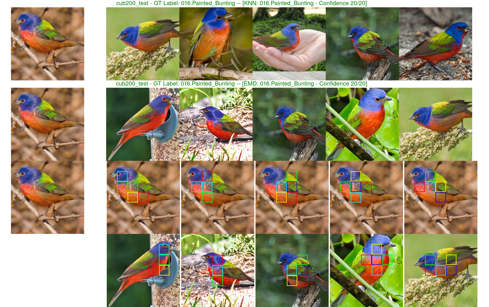
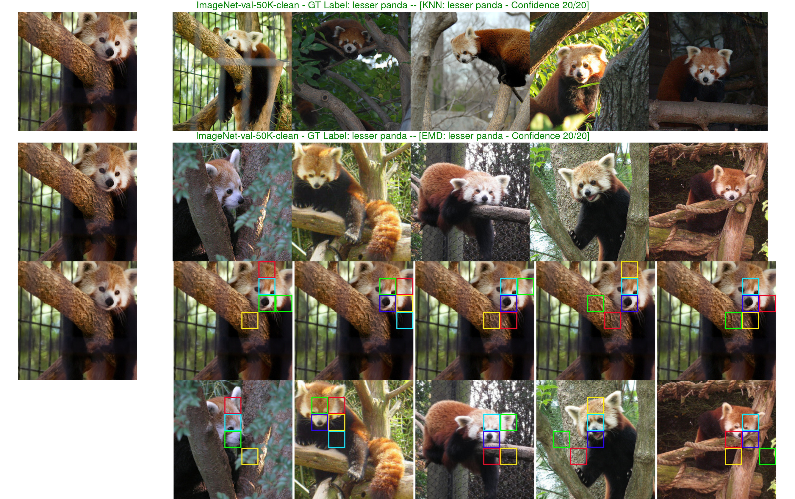
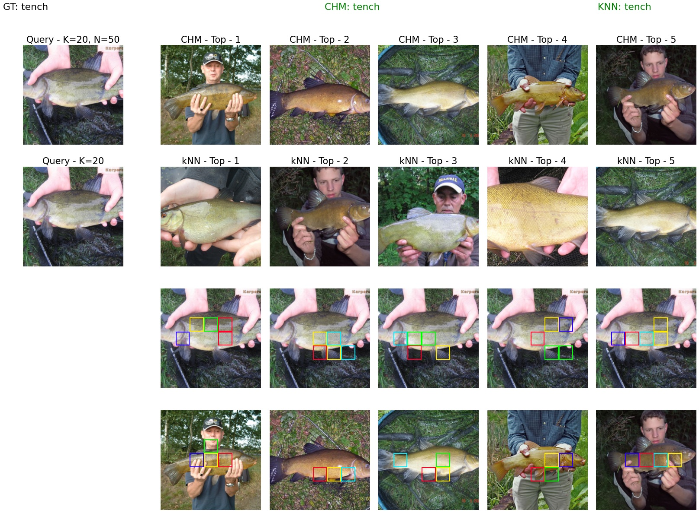

<div align="center">    
 
# Visual correspondence-based explanations improve AI robustness and human-AI team accuracy 
by [Giang Nguyen *](https://giangnguyen2412.github.io/), [Mohammad R. Taesiri *](https://taesiri.com/), and [Anh Nguyen](https://anhnguyen.me/). 

\* equal contribution.

[](https://arxiv.org/abs/2208.00780)
 [](https://openreview.net/forum?id=UavQ9HYye6n)
[](https://xai4cv.github.io/workshop)
[](https://www.dropbox.com/s/1neko0pjbexlsjf/p49.pdf?dl=0)
[](https://huggingface.co/spaces/XAI/CHM-Corr)
[](https://aub.ie/corr)
</div> 

_**tldr:** We propose two architectures of interpretable image classifiers that first explain, and then predict by harnessing the visual correspondences between a query image and exemplars.
Our models improve on several out-of-distribution (OOD) ImageNet datasets while achieving competitive performance on ImageNet than the black-box baselines (e.g. ImageNet-pretrained ResNet-50). 
On a large-scale human study (∼60 users per method per dataset) on ImageNet and CUB, our correspondence-based explanations led to human-alone image classification accuracy and human-AI team accuracy that are consistently better than that of kNN. 
We show that it is possible to achieve complementary human-AI team accuracy (i.e., that is higher than either AI-alone or human-alone), on ImageNet and CUB._   

:star: Follow-up work: Interactive [demo](https://aub.ie/corr) of CHM-Corr++ (image classifiers that make predictions based on human-guided patch attention)

If you use this software, please consider citing:

    @inproceedings{taesirivisual,
      title={Visual correspondence-based explanations improve AI robustness and human-AI team accuracy},
      author={Taesiri, Mohammad Reza and Nguyen, Giang and Nguyen, Anh},
      booktitle={Advances in Neural Information Processing Systems}
    }

## 1. Requirements
```
python=3.9.7
pytorch=1.10.0
torchvision=0.11.1
numpy=1.21.2
pip install tqdm
pip install seaborn
```
Since each classifier was developed independently, you can also run ```conda env create -f [classifier_name]/env.yml``` to create the virtual environment before running.

## 2. How to run
### 2.1 Reproduce classifiers' performance

To reproduce the accuracy of image classifiers in **Table 1**, please run:
```bash
cd [classifier_name]
sh test.sh
```

For the bird classification (CUB dataset) using iNaturalist pretrained ResNet-50 please refere to [`ResNet-50/README.md`](https://github.com/anguyen8/visual-correspondence-XAI/blob/main/ResNet-50/README.md)


### 2.2. Reproduce performance on a specific dataset

#### 2.2.1. For the EMD-Corr classifier

To reproduce the accuracy of image classifiers on a specific dataset (e.g. CUB200) in **Table 1**, please run:
```bash
cd [classifier_name]
sh run -d [DATASET] -v False -i [True/False]
```

To see available options, run:
```bash
sh run ?  # 
```

For example, running ```EMD-Corr``` for **CUB-200** using iNaturalist-pretrained ResNet-50 feature.
```bash
sh run.sh -d cub200_test -v False -i True
```

#### 2.2.2. For the CHM-Corr classifier

For the **CHM-Corr** classifier, a detailed description is available in [`CHM-Corr/README.md`](https://github.com/anguyen8/visual-correspondence-XAI/blob/main/CHM-Corr/README.md).

### 2.3. Visualize correspondence-based explanations


#### 2.3.1. Visualize EMD-Corr explanations
To visualize correspondence-based explanations by EMD-Corr, just simply run:
```bash
cd EMD-Corr/
# Turn the visualization (v) option to True
sh run -d [DATASET] -v True -i [True/False]
```

For example, running on CUB-200 bird images:
```bash
sh run.sh -d cub200_test -v True -i True
```
then we get:

* The first row is the exemplars retrieved by kNN while the second one shows the re-ranked exemplars by EMD-Corr classifier.
The third row (query) and the fourth row (EMD-Corr exemplars) show how the query matches each of the exemplars given by comparing the same-color boxes (e.g. face to face, neck to neck).
Both kNN and EMD-Corr correctly classified the bird.

If you want to visualize explanations for general images from ImageNet, run:
```bash
# Now turn the visualization (v) option to True and use torchvision ImageNet-pretrained ResNet-50 feature (i - False)
sh run.sh -d imagenet1k-val -v True -i False
```


* EMD-Corr matches these ```panda``` pairs by looking at facial features. 

#### 2.3.2. Visualize CHM-Corr explanations (CHM-Corr [interactive demo](https://aub.ie/corr))

We provide a notebook to generate a visualization of the CHM-Corr classifier's output. Please first run CHM-Corr using the guide provided in [`CHM-Corr/README.md`](https://github.com/anguyen8/visual-correspondence-XAI/blob/main/CHM-Corr/README.md), then use [`CHM-Corr/src/visualization/visualization.ipynb`](https://github.com/anguyen8/visual-correspondence-XAI/blob/main/CHM-Corr/src/visualization/visualization.ipynb) to generate the visualizations.



### 2.4. Try it yourself
#### 2.4.1. Instructions for EMD-Corr
* Step 1: Run kNN to get the shortlisted exemplars. 
* Step 2: Re-rank the exemplars using **EMD** patch-wise comparison.
```python
# EMD-Corr distance calculation between query vs. K exemplars
# fb = fb_center = tensor containing query (first row) + K exemplar embeddings. e.g. 51x2048x7x7 where conv4_dim=2048x7x7.
# q2q_att and g2q_att is the correlation maps of the query (q) to the exemplars (g) or vice versa. 
# opt_plan is the optimal transport plan used for visualization.
from emd_utils import EMDFunctions
emd_distance, q2g_att, g2q_att, opt_plan = EMDFunctions.compute_emd_distance(K=50, fb_center, fb, use_uniform=False, num_patch=5)
```
* Step 3: Perform majority vote on the re-ranked exemplars to get the top-1 label.

#### 2.4.2. Instructions for CHM-Corr

For the **CHM-Corr** classifier, a detailed description is available in [`CHM-Corr/README.md`](https://github.com/anguyen8/visual-correspondence-XAI/blob/main/CHM-Corr/README.md).


## 3. Human study (XAI human evaluation)
### 3.1. ImageNet clean data for human study

We filtered out ImageNet validation images

* having no labels based on ImageNetReaL labels.

* having duplicates with the ImageNet training set.

* having grayscale color or low resolution (i.e. H or W < 224).

to get 44,424 clean images as described in Sec. 2.3.2 of our paper. We share the IDs of these clean images in [a text file](https://github.com/anguyen8/visual-correspondence-XAI/blob/b234be2d4cc42e865682c00a86cd63e2b0a9fe9c/EMD-Corr/clean_images/ImageNet_Clean.txt).

### 3.2. Human study interface

We recorded a [video](https://youtu.be/rJx-vGJBprw) to walk you through the human study interface (Introduction &rarr; Training &rarr; Validation &rarr; Test) &mdash; described in Sec. 2.3.3. You may also notice the tricks we applied in the experiments to improve crowdsourcing data quality as [mentioned](https://twitter.com/BeOnlineConf/status/1544355623743225859/photo/1) by [BeOnline](https://twitter.com/BeOnlineConf). 

We hope sharing all screens we carefully designed could help future research perform human studies easier.

If you wanna try out the UI on your device or get more materials to replicate the experiment pipeline, please contact us.

We also share the [training screens](https://drive.google.com/drive/folders/1S0ipBx8H8JDM-tERImHVHFz-YDwE2gf6?usp=sharing) and [test trials](https://drive.google.com/drive/folders/1EWC3hgivx1SA0V2bL2toBnNZvtJWnoGu?usp=sharing) for both human studies on Google Drive.

### 3.3. Human-study Huggingface demo for pilot studies

We also made an experimental UI for internal testing, which can be accessed on the Huggingface spaces. 

[](https://huggingface.co/spaces/XAI/VisualCorrespondenceHumanStudy)
[](https://huggingface.co/spaces/XAI/VisualCorrespondenceHumanStudy-CUB)

## 4. Acknowledgment

* The CHM-Corr classifier relies on [CHMNet](https://github.com/juhongm999/chm) to find correspondence points between two images.
* The [code](https://github.com/anguyen8/visual-correspondence-XAI/blob/main/ResNet-50/CUB-iNaturalist/FeatureExtractors.py) for feature extraction using iNaturalist pretraind ResNet-50 was kindly provided by [Jon Donnelly](mailto:jonathan.donnelly@maine.edu)

## 5. License
[MIT](LICENSE)
